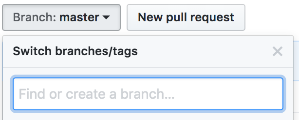

## 资源

* [hexo官网](https://hexo.io/zh-cn/)

## 搭建

#### 1. 配置站点

一般hexo初始化后的站点目录结构如下

```Plain
/blog
 |-- _config.yml # 站点配置文件
 |-- scaffolds   # 页面模板存放的目录
 |      |-- post.html # 博文模板
 |      |-- page.html # 分页模板
 |      \-- draft.html # 草稿模板
 |-- source         # 博客正文和其他源文件，404、favicon、CNAME 都应该放在这里
 |      |-- _posts  # 存放博文的目录
 |      \-- _drafts # 存放草稿的目录
 |-- themes      # 存放主题文件夹的目录
 |-- package.json  # npm 依赖等
 |-- node_modules # 功能依赖包
 \-- .gitignore   # push的时候忽略node_modules文件夹等
```

修改`_config.yml`文件，整个站点的配置主要是在这个文件中修改

```
title: 博客名
description: 博客简述
author: 作者名
url: http(s)://your.site.com
root: /your/project/path or /

deploy:
  type: git
  //repo: git@github.com:userName/userName.github.io.git   // ssh  
  repo: https://github.com/userName/userName.github.io.git  // https
  branch: gh-pages // 真正要显示的内容是放在master分支下
  message: [自定义的提交信息]
```

#### 2. 撰写博文

每当需要撰写心得博文时，只需要执行以下命令，就可以得到一个标题和日期已经设置好的markdown文件

```
hexo new [layout] '博文标题' # layout是可选项，表示使用哪种模板来创建页面文件，默认是post
```

博文结构的头部

```
title: 博文标题
date: yyyy-mm-dd  # 日期是创建博文源文件时自动生成的
categories:
- category1
- category2
tags:
- tag1
- tag2
comments: true
```

#### 3. 更新 & 部署站点到Github Pages

```
// hexo new '博文标题'
hexo clean # 删除之前生成的静态文件
hexo generate # 生成编译后的静态站点文件
hexo deploy # 部署到远程仓库
```

> 需要说明的是：
>
> 我们博客文章的编写都是Markdown文件，但是发布到github上的其实是html文件，将Markdown转换成html这个工作我们只要输入hexo generate命令即可，hexo会帮我们完成转换。
>
> 注意：
>
> 貌似目前不支持new中文名

如果发现错误

```
ERROR Deployer not found: git
```

安装

```
npm install hexo-deployer-git --save // inside the project folder
```

再次deploy

```
hexo d
```

#### 4. 本地隐藏文件夹`.deploy_git` 对应的是github上的内容

```
drwxr-xr-x  12 jing.li  staff    408 Apr 21 17:01 .git
drwxr-xr-x   3 jing.li  staff    102 Apr 21 16:58 2018
-rw-r--r--   1 jing.li  staff     54 Apr 21 16:58 README.md
drwxr-xr-x   4 jing.li  staff    136 Apr 21 16:58 archives
drwxr-xr-x   3 jing.li  staff    102 Apr 21 16:58 categories
drwxr-xr-x   3 jing.li  staff    102 Apr 21 16:58 css
drwxr-xr-x  20 jing.li  staff    680 Apr 21 16:58 images
-rw-r--r--   1 jing.li  staff  26989 Apr 21 16:58 index.html
drwxr-xr-x   3 jing.li  staff    102 Apr 21 16:58 js
drwxr-xr-x  16 jing.li  staff    544 Apr 21 16:58 lib
drwxr-xr-x   5 jing.li  staff    170 Apr 21 16:58 tags
```

本地blog dir里面是

```
drwxr-xr-x   12 jing.li  staff     408 Apr 21 16:49 .deploy_git
-rw-r--r--    1 jing.li  staff    1900 Apr 21 16:59 _config.yml
-rw-r--r--    1 jing.li  staff     174 Apr 21 16:49 db.json
drwxr-xr-x  263 jing.li  staff    8942 Apr 21 12:12 node_modules
-rw-r--r--    1 jing.li  staff  103985 Apr 21 12:12 package-lock.json
-rw-r--r--    1 jing.li  staff     483 Apr 21 12:12 package.json
drwxr-xr-x   11 jing.li  staff     374 Apr 21 12:39 public
drwxr-xr-x    5 jing.li  staff     170 Apr 21 11:05 scaffolds
drwxr-xr-x    3 jing.li  staff     102 Apr 21 11:05 source
drwxr-xr-x    4 jing.li  staff     136 Apr 21 11:31 themes
```

展示.deploy_git

```
drwxr-xr-x  12 jing.li  staff    408 Apr 21 17:03 .git
drwxr-xr-x   3 jing.li  staff    102 Apr 21 16:49 2018
drwxr-xr-x   4 jing.li  staff    136 Apr 21 16:49 archives
drwxr-xr-x   3 jing.li  staff    102 Apr 21 16:49 categories
drwxr-xr-x   3 jing.li  staff    102 Apr 21 16:49 css
drwxr-xr-x  20 jing.li  staff    680 Apr 21 16:49 images
-rw-r--r--   1 jing.li  staff  27937 Apr 21 12:39 index.html
drwxr-xr-x   3 jing.li  staff    102 Apr 21 16:49 js
drwxr-xr-x  16 jing.li  staff    544 Apr 21 16:49 lib
drwxr-xr-x   5 jing.li  staff    170 Apr 21 16:49 tags
```

#### 5. 多PC同步

现在我们了解了hexo部署的真正流程

* `hexo new`  创建新的文章
* `hexo generate` render 并更新`public` folder
* `hexo deploy`把`public` folder中的内容拷贝到`.deploy_git` 中，再git push到github

github上的东西并不是blog dir里面的内容，而只是`blog_dir/.deploy_git` 的内容，要想在别的机器上也创造一个可以更新博客的站点，你必须把完整的blog dir拷贝到另外一台机器上

* 方法一：把blog dir放置在google drive里面，然后在新机器上就把google drive的blog dir拷贝过去，并安装node, git, hexo即可
* 方法二：把这个blog dir放在`username.github.io`repo的另外一个分支下，相当于是用github代替了google drive来保存blog dir，而且它存放在同一个repo的上，方便管理和维护。

由于我现在已经创建好了blog dir，我相当于是要把这个existing的folder变成`username.github.io`这个repo的hexo分支

在github上的该repo下创建一个分支hexo


在本地显示不出来，但是在blog上能显示出来！【非常奇怪】


把这个分支hexo而不是默认的master给下载下来

```
git clone -b hexo  https://github.com/username/username.github.io.git aaaa
```

aaaa是为了不跟username.github.io冲突的名字而已，反正用完之后会删掉，起什么名字都无所谓

把local blog dir放入hexo分支下

`.git`存放了repo所有相关的metadata，拷贝`.git`到`username.github.io`文件夹，完成导入repo的工作

```
cd aaaa
mv .git ../username.github.io
```

添加`db.json` ， `public` ，`.deploy_git` 到`.gitignore`

* `db.json`是缓存文件

添加所有untracked和unstaged文件，然后push到远端的hexo

```
git push origin hexo
```

至此

* blog dir驻守username.github.io的hexo分支，用git来管理和更新
  * hexo分支在这里就是github本身提倡的`gh-pages`分支，即用来存放生成站点的source分支
* blog本身的内容(`deploy_git`)驻守username.github.io的master分支，用hexo来管理和更新

> 如果你现在的blog dir是崭新的，你不妨在创建username.github.io这个repo的时候就先创建hexo分支，这样就不需要这样繁琐的补救措施


## 全局配置`_config.xml`

#### 更改主题

从[hexo themes](https://hexo.io/themes/)找到合意的主题，clone下来，放到站点本地仓库的`themes`目录下，比如我现在想添加主题next，在blog dir下执行

```
git clone https://github.com/iissnan/hexo-theme-next themes/next
```

再修改blog`_config.yml`文件的`theme`字段为对应的主题名

```
theme: next
```

#### 如何添加多个tags

有两种多标签格式

```
tags: [a, b, c]
或
tags:
  - a
  - b
  - c
```

#### 如何添加categories

只有post支持分类和标签，您可以在 Front-matter 中设置。

在其他系统中，分类和标签听起来很接近，但是在 Hexo 中两者有着明显的差别：分类具有顺序性和层次性，也就是说 `Foo, Bar` 不等于 `Bar, Foo`；而标签没有顺序和层次。

```
categories:
- Diary
tags:
- PS3
- Games
```

> **分类方法的分歧**
>
> 如果您有过使用WordPress的经验，就很容易误解Hexo的分类方式。WordPress支持对一篇文章设置多个分类，而且这些分类可以是同级的，也可以是父子分类。**但是Hexo不支持指定多个同级分类。下面的指定方法：**
> categories:
> \- Diary
> \- Life
> 会使分类`Life`成为`Diary`的子分类，而不是并列分类。**因此，有必要为您的文章选择尽可能准确的分类**。

#### 添加插件

添加 sitemap

切换到你本地的 hexo 目 CIA ，在命令行窗口，输入以下命令

```
npm install hexo-generator-sitemap -save
```

修改 _config.yml，增加以下内容

```
# Extensions
Plugins:
- hexo-generator-sitemap
#sitemap
sitemap:
  path: sitemap.xml
```

再执行以下命令，部署服务端

```
hexo d -g
```

#### 站内搜索

next主题的官方文档提供了几种实现搜索服务的方式，我们就使用配置最简单的Local Search，添加百度/谷歌/本地 自定义站点内容搜索。

（1）安装 hexo-generator-searchdb，在站点目录下执行以下命令：

```
$ npm install hexo-generator-searchdb --save
```

（2）编辑全局配置文件，新增以下内容到任意位置：

```
search:
  path: search.xml
  field: post
  format: html
  limit: 10000
```

（3）在主题配置文件里面的修改

```
local_search:
  enable: true
```

#### 评论系统

duoshuo倒闭了，[Gitment](https://github.com/imsun/gitment) 是基于 GitHub Issues 的评论系统。支持在前端直接引入，不需要任何后端代码。可以在页面进行登录、查看、评论、点赞等操作，同时有完整的 Markdown / GFM 和代码高亮支持。尤为适合各种基于 GitHub Pages 的静态博客或项目页面。

对于hexo+Github搭建的博客，使用Gitment应该是最好的选择了，因为他是基于Github的Issue来做的，每篇文章的评论会创建一个Issue。尽管还有类似的开源项目，比如Gittalk也可以实现同样的功能，由于我使用的是next主题，所以Gitment的默认样式可能更适合我的博客，虽然样式是可以自定义的，但是对于我这种不会前端的人来说怎么简单怎么来吧。

具体操作看[这里](http://fanzhenyu.me/2017/12/03/Github-Pages-Hexo%E6%90%AD%E5%BB%BA%E5%8D%9A%E5%AE%A2%EF%BC%88%E4%BA%94%EF%BC%89/), [这里](https://imsun.net/posts/gitment-introduction/)


## Theme配置`theme/your_theme/_config.xml`

#### 选择外观样式

目前 NexT 支持三种 Scheme，他们是：

Muse - 默认 Scheme，这是 NexT 最初的版本，黑白主调，大量留白

Mist - Muse 的紧凑版本，整洁有序的单栏外观

Pisces - 双栏 Scheme，小家碧玉似的清新

Gemini - 在Pisces的基础上以box区分各篇文章

[](http://ohe7ixo05.bkt.clouddn.com/2016/12/2-2.png)

找到主题配置文件的如下三行，其中#号表示注释，要启用哪一种样式就把#号去掉即可。

```
# Schemes
#scheme: Muse
#scheme: Mist
#scheme: Pisces   # 带sidebar
scheme: Gemini  # 带sidebar，每篇文章是一个单独的box[选用]
```

#### Menu Settings

新建tags, catagories页面

```
$ hexo new page tags   # 会在source/下生成tags/index.md文件
$ hexo new page categories   # 会在source/下生成categories/index.md文件
```

确认主题配置文件有

```
vim current_theme/_config.xml
tags: tags
```

#### 加about页面

TBD

#### 加404页面

TBD

#### 显示部分文章内容

方法1：如果在博客文章列表中，不想全文显示，可以增加 `<!-- more -->`, 后面的内容就不会显示在列表。

```
---
front-matter
---
这是摘要
<!-- more -->
这是正文
```

这种方法可以根据文章的内容，自己在合适的位置添加 `< !--more-->` 标签，使用灵活，也是Hexo推荐的方法。

方法2：在文章中的`front-matter`中添加description，并提供文章摘录
这种方式只会在首页列表中显示文章的摘要内容，进入文章详情后不会再显示。


方法3：自动形成摘要，在**主题配置文件**中添加
默认截取的长度为 150 字符，可以根据需要自行设定

```
auto_excerpt:
  enable: true
  length: 150
```

**建议使用 < !-- more -->（即第一种方式），除了可以精确控制需要显示的摘录内容以外， 这种方式也可以让 Hexo 中的插件更好的识别。** 而我选用方法3的auto_excerpt = true后发现不是很美观，还是用方法1好


## 其他

#### 图片

**图片存储**

* 方法1：使用七牛云进行图片存储
* 方法2：使用hexo github仓库进行图片存储
  * 在hexo/source目录下新建一个img文件夹，将图片放入该文件夹下，插入图片时链接即为`/img/图片名称`。这样做也存在一定的缺点，因为Github仓库的的大小也是受限的，所以图片太多就比较麻烦了，所以还是建议用图床等其他云存储方式。

**优雅的在博客上插入图片：资源文件夹**

资源（Asset）代表 `source` 文件夹中除了文章以外的所有文件，例如图片、CSS、JS 文件等. 比方说，如果你的Hexo项目中只有少量图片，那最简单的方法就是将它们放在 `source/images` 文件夹中。然后通过类似于 `` 的方法访问它们。

首先确认全局`_config.yml`中更改

```
_config.yml
post_asset_folder: true
```

当资源文件管理功能打开后，Hexo将会在你每一次通过 `hexo new [layout] <title>` 命令创建新文章时自动创建一个文件夹。这个资源文件夹将会有与这个 markdown 文件一样的名字。将所有与你的文章有关的资源放在这个关联文件夹中之后，你可以通过相对路径来引用它们，这样你就得到了一个更简单而且方便得多的工作流。

**安装hexo-asset-image插件**

你需要安装一个图片路径转换的插件，这个插件名字是**hexo-asset-image**，我目前安装的是最新的0.03版本，使用如下命令安装插件

```
npm install https://github.com/CodeFalling/hexo-asset-image –save
```

图片的插入和显示方式**

**方法1**：本地图片测试



并没有成功使用``这样的路径，而是必须把相对路径写正确``才能即在编写时看见图片也能在发布后看见图片

**方法2**： `post_asset_folder: true`设置后使用标签插件来显示图片

通过常规的 markdown 语法和相对路径来引用图片和其它资源可能会导致它们在存档页或者主页上显示不正确。在Hexo 2时代，社区创建了很多插件来解决这个问题。但是，随着Hexo 3 的发布，许多新的标签插件被加入到了核心代码中。这使得你可以更简单地在文章中引用你的资源。

比如说：当你打开文章资源文件夹功能后，你把一个 `example.jpg` 图片放在了你的资源文件夹中，如果通过使用相对路径的常规 markdown 语法 `` ，它将*不会*出现在首页上。（但是它会在文章中按你期待的方式工作）

正确的引用图片方式是使用下列的标签插件而不是 markdown ：

```

```

通过这种方式，图片将会同时出现在文章和主页以及归档页中。



> 这种奇怪的方式我不明白为什么会被官方采纳，因为它最大的弱点在于，在编写文章时，你看到的是一行标签代码，而不能显示图片，也就是使用markdown编辑器进行文章编写时，不能可见即所得。

**方法3**： 直接用html来显示图片

``

同样的该图片无法在编写文章时看见，而且还占据了整整一行的空间，编写的时候造成文章格式非常难看

**什么时候需要图床**

* 如果你的Hexo项目中只有少量图片，那最简单的方法就是将它们放在 `source/images` 文件夹中。然后通过类似于 `` 的方法访问它们。
  * 如果有大量的图片，则最好使用图床，[极简图床 + chrome 插件 + 七牛空间](https://jiantuku.com/#/)，七牛云储存提供10G的免费空间,以及每月10G的流量，存放个人博客外链图片最好不过了，七牛云储存还有各种图形处理功能、缩略图、视频存放速度也给力。

**修改如图所示的网站 icon：**

在博客 `img` 目录下找到并替换 `favicon.ico` 这个图标即可，图标尺寸为`32x32`。

**Mac 上的图床神器：iPic**

直接在App Store上下载，谁用谁知道！

使用方法很简单，直接拖动图片到 P 图标上，或者选中图片按快捷键 `⌘+U`，就能请示上传。

上传成功就能直接粘贴图片的URL。

**图片压缩工具[ImageOptim](https://link.jianshu.com?t=https%3A%2F%2Fimageoptim.com%2F)**

对于我们的博客来说，图片越大，加载速度越慢。

不信你用手机打开你的博客试试~

所以有必要对我们上传到博客网站中的图片：指的是你的头像，首页背景图片，文章背景图片等。对于博客文章中插入的图片，其实也可以压缩了再上传。

对博客中的所有图片进行压缩：

看看压缩结果，最高的一张压缩了78.7%，这简直是太可怕了！

#### 开启打赏功能

next主题开启打赏功能很简单，我们只需要在全局配置文件中填入微信和支付宝收款二维码图片地址即可开启该功能。先到微信和支付宝将自己收款二维码图片保存，我们同样可以将其存在七牛云上，然后贴到下面的配置文件里。

```
reward_comment: 坚持原创技术分享，您的支持将鼓励我继续创作！
wechatpay: 微信当面付图片的url
alipay: 支付宝当面付图片的url
```

#### 博客备份

一直想着怎么把博客备份一下，以便丢失时或者是换电脑时能够接着写博客，终于找到一个靠谱的插件，直接将文件备份在博客的仓库中的不同分支，十分方便。

项目地址：<https://github.com/coneycode/hexo-git-backup>

**安装**

如果hexo的版本是2.x.x则执行如下命令:

```
$ npm install hexo-git-backup@0.0.91 --save
```

如果hexo的版本是3.x.x, 则执行:

```
$ npm install hexo-git-backup --save
```

**配置**

在全局配置文件_config.yml中添加如下信息：

```
backup:
  type: git     # 指定提交类型
  message: update xxx   # 添加git commit信息
  repository:   # 指定仓库类型和地址
    github: git@github.com:xxx/xxx.git,分支名字
```

#### 使用Latex数学公式

Hexo默认使用”hexo-renderer-marked”引擎渲染网页，该引擎会把一些特殊的markdown符号转换为相应的html标签，比如在markdown语法中，下划线’_’代表斜体，会被渲染引擎处理为*标签。*

因为类Latex格式书写的数学公式下划线 ‘_’ 表示下标，有特殊的含义，如果被强制转换为*标签，那么MathJax引擎在渲染数学公式的时候就会出错。例如，$x_i$在开始被渲染的时候，处理为$xi$，这样MathJax引擎就认为该公式有语法错误，因为不会渲染。*

类似的语义冲突的符号还包括’*’, ‘{‘, ‘}’, ‘\’等。

进入到主题目录，找到_config.yml配置问题，把mathjax默认的false修改为true，具体如下：

```
# MathJax Support
mathjax:
  enable: true
  per_page: true
```

此外，还需要在文章的Front-matter里打开mathjax开关，如下：

```
---
title: index.html
date: 2017-03-28 21:01:30
tags:
mathjax: true
--
```

每篇文章都要，所以还不如添加到模板中，打开scaffolds/post.md

```
---
title: {{ title }}
date: {{ date }}
mathjax: true
tags:
---
```

看下效果如何

$x_i$


## MISC

#### hexo标签

标签插件（Tag Plugins）是hexo自己的liquid in markdown，用于在文章中快速插入特定内容的插件

> 【注意】在markdown 中添加太多的hexo 标签，其实会在以后用其他编辑器预览，查看，迁移时留下诸多不变，毕竟，私有的语法意味着不兼容。不建议使用！

#### hexo的适用场景

- GitHub Pages 不支持数据库管理，所以你只能做静态页面的博客，不能像其他博客（如 WordPress）那样通过数据库管理自己的博客内容。
- 但是GitHub Pages 无需购置服务器，免服务器费的同时还能做负载均衡，github pages有300M免费空间。


- 通过 Hexo 你可以轻松地使用 Markdown 编写文章，非常符合我的口味。Markdown 真的是专门针对程序员开发的语言啊，现在感觉没有 Markdown什么都不想写。什么富文本编辑器，什么word，太麻烦了！而且样式都好丑！效率太低！

#### 开启打赏功能

next主题开启打赏功能很简单，我们只需要在全局配置文件中填入微信和支付宝收款二维码图片地址即可开启该功能。先到微信和支付宝将自己收款二维码图片保存，我们同样可以将其存在七牛云上，然后贴到下面的配置文件里。

```
reward_comment: 坚持原创技术分享，您的支持将鼓励我继续创作！
wechatpay: 微信当面付图片的url
alipay: 支付宝当面付图片的url
```

实现效果：

[](http://ohe7ixo05.bkt.clouddn.com/2016/12/5-13.png)

Github pages + Hexo搭建静态博客站点的系列文章到这里就完结了，其实也算是一个很详细的教程了，花了一些时间来整理。之后可能不会再更新，但是，如果之后遇到一些问题或者有更好的推荐，可能还会再写。

#### 插入音乐

　　网音乐云音乐，虾米音乐都可以生成内嵌音乐的html代码，在其网页端找到喜欢的歌曲，点击分享按钮，把里面的代码复制下来，直接粘贴到博文中即可:

```
<iframe frameborder="no" border="0" marginwidth="0" marginheight="0" width=330 height=86   
    src="http://music.163.com/outchain/player?type=2&id=450853439&auto=1&height=66">  
</iframe>
```

#### 插入视频

　　将优酷等视频平台提供的视频外链或者自己制作的视频外链替换掉如下src的值即可。

```
<iframe   
    height=498 width=510   
    src="http://player.youku.com/embed/XNjcyMDU4Njg0"   
    frameborder=0 allowfullscreen>  
</iframe>
```

#### 友情链接

```
blogrolls: #友情链接
  - bruce sha's duapp wordpress: http://ibruce.duapp.com
  - bruce sha's javaeye: http://buru.iteye.com
  - bruce sha's oschina blog: http://my.oschina.net/buru
  - bruce sha's baidu space: http://hi.baidu.com/iburu
```

#### 制作ICO图标

favicon.ico一般用于作为缩略图的网站标志，[在线制作网站](http://www.bitbug.net/)


##### Hexo环境

Hexo环境的搭建看过不少文章，但对我而言是极其繁琐和陌生的，而我的目的主要在于利用它来写博客，我在意的是我博客的内容而不是搭建博客自身的过程，因此我是直接使用了[Hexo懒人携带版 / PortableHexo](http://etrd.org/2017/01/23/hexo%E4%B8%AD%E5%AE%8C%E7%BE%8E%E6%8F%92%E5%85%A5%E6%9C%AC%E5%9C%B0%E5%9B%BE%E7%89%87/Hexo%E6%87%92%E4%BA%BA%E6%90%BA%E5%B8%A6%E7%89%88%20/%20PortableHexo)，它的优势是，纯傻瓜式操作，无法安装hexo git nodejs等环境，压缩包解压直接用，直接发布，十分感谢这个懒人包团队的工作。该懒人包内相关软件的版本如下


